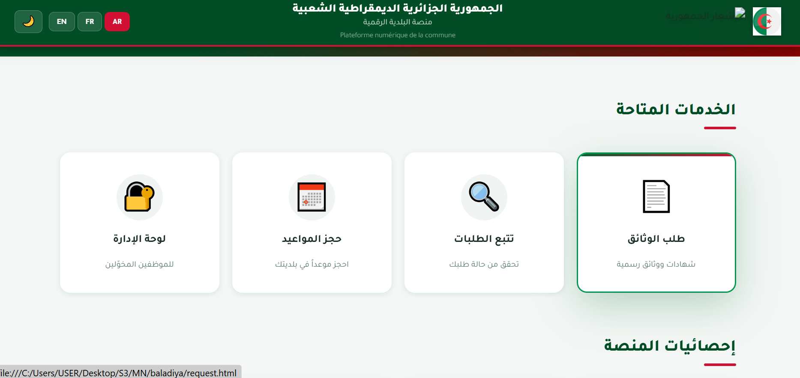
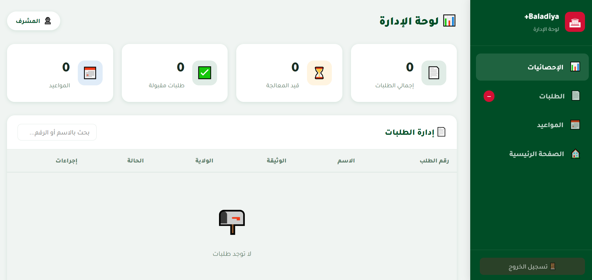

# baladia
# 🏛️ Municipality E-Services Website

A comprehensive web platform designed to digitalize municipality services and bridge the communication gap between citizens and local administration. This platform allows citizens to access local news, submit requests, and learn how to extract official administrative documents seamlessly.

## ✨ Features
* 📑 **Administrative Documents Guide:** A detailed directory explaining how to obtain official documents (e.g., birth certificates, building permits).
* 📨 **Complaints & Suggestions System:** Enables citizens to submit feedback or complaints directly to the municipality and track their status.
* 🔐 **Admin Dashboard:** A secure control panel for municipality staff to manage content, review citizen requests, and update data.
* 📱 **Fully Responsive:** A user-friendly interface optimized for all screen sizes, including smartphones, tablets, and desktops.

## 🛠️ Tech Stack
* **Frontend:** HTML5, CSS3, JavaScript 
* **Styling:** Custom CSS
* **Backend:** PHP
* **Database:** MySQL 

## 📸 Screenshots

## 🚀 Installation & Setup

To run this project locally, ensure you have [Git] and [Node.js] installed, then follow these steps:

👥 Authors
Meroua Moulai - Frontend Developer
💡 This project was developed as an academic project to provide technical solutions for local community service.
